# Your-Money — Personal Money Management

Aplikasi Personal Money Management production-ready yang dibangun menggunakan Next.js 15 App Router, TypeScript, TailwindCSS, shadcn/ui, Drizzle ORM, Cloudflare D1, dan Telegram Bot.

---

## Pratinjau Antarmuka Aplikasi

### Dashboard Utama
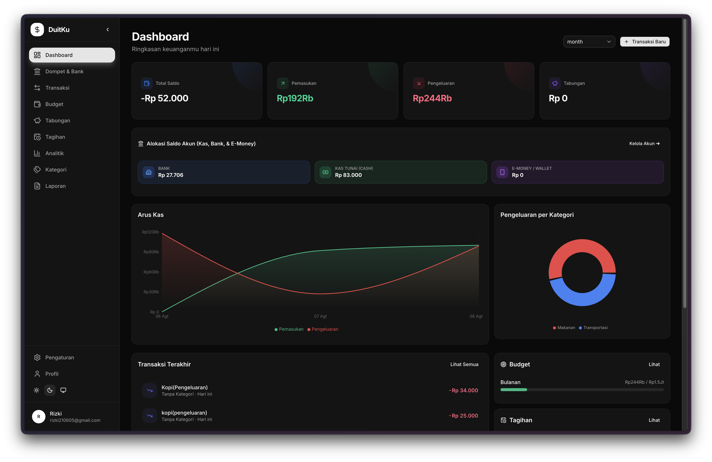

### Manajemen Transaksi
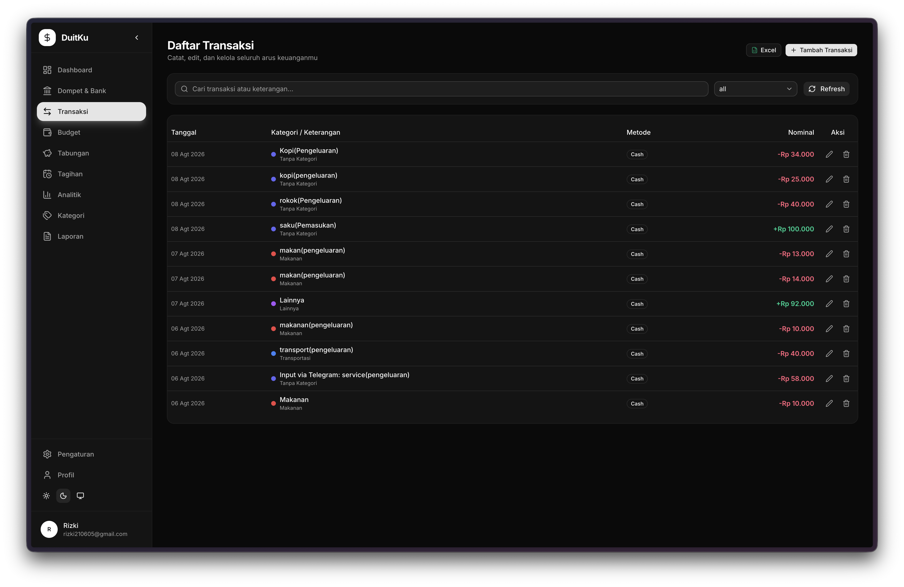
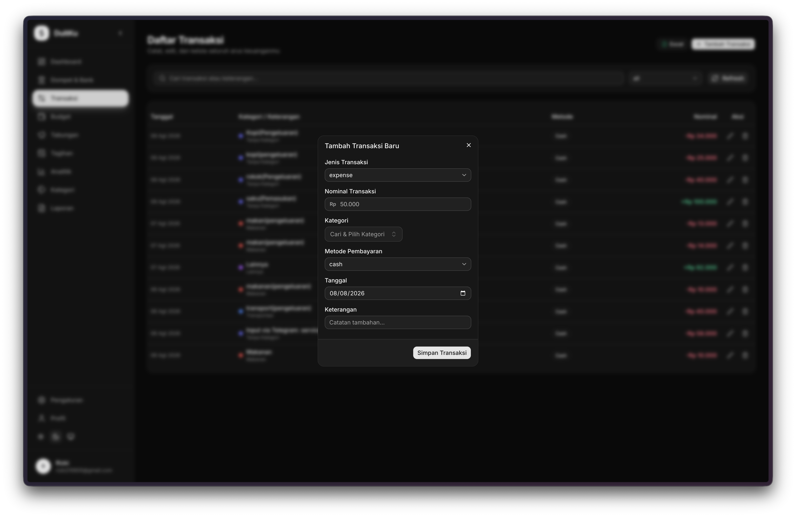

### Manajemen Dompet & Rekening Keuangan
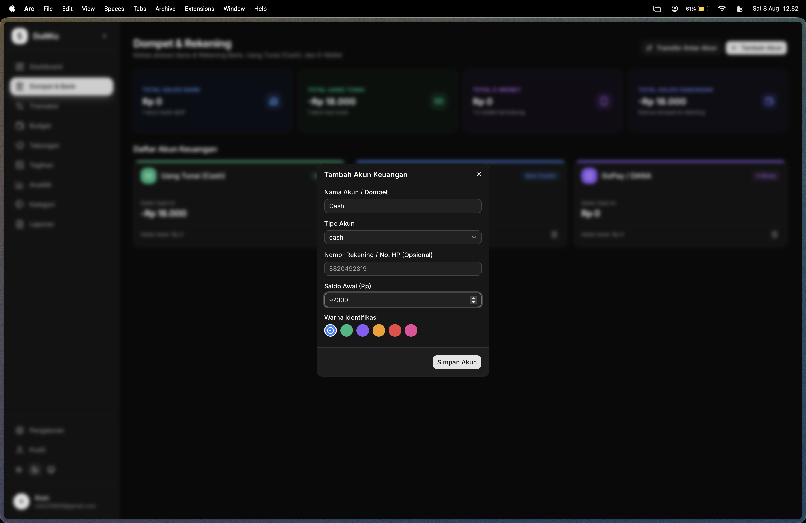

### Anggaran & Budgeting
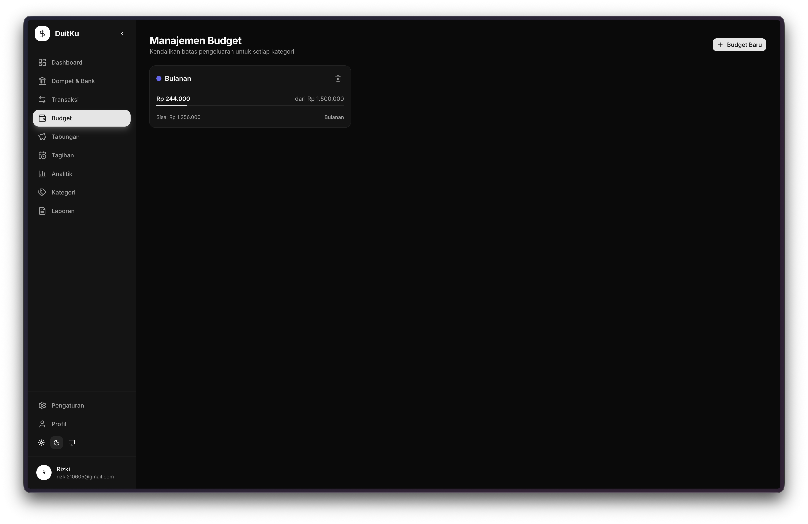
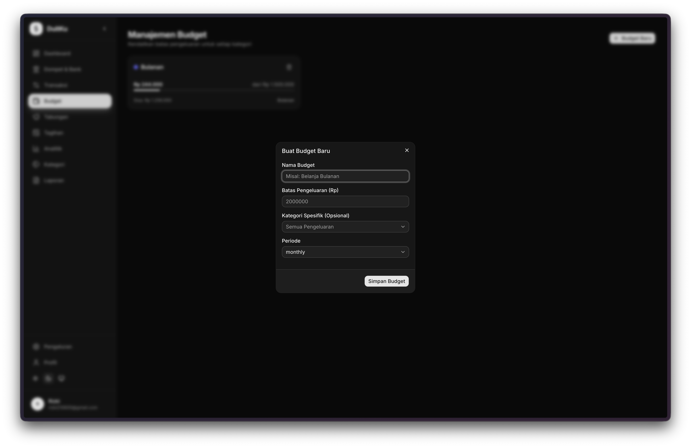

### Kalkulator & Status Dana Darurat
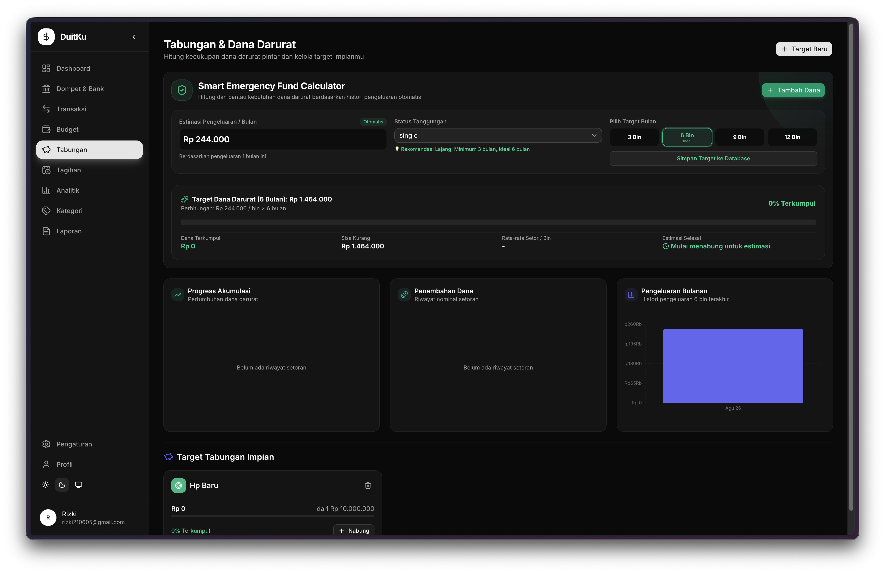

### Manajemen Tagihan Rutin
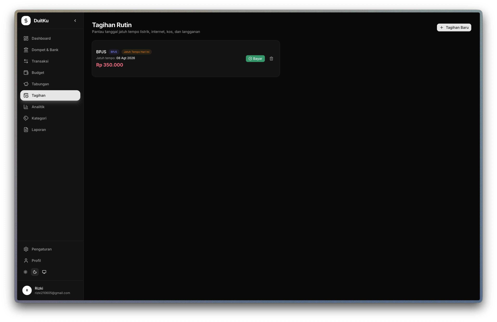
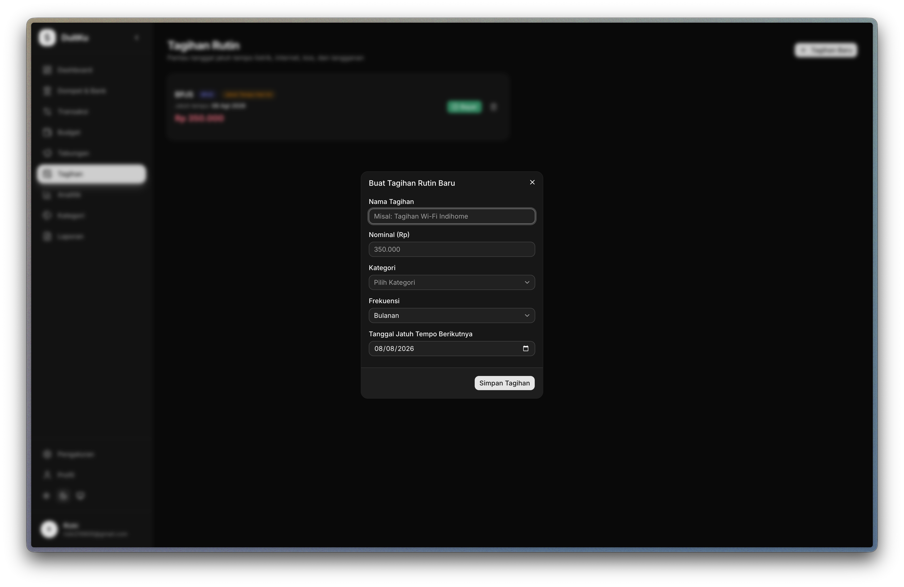

### Analitik & Laporan Keuangan
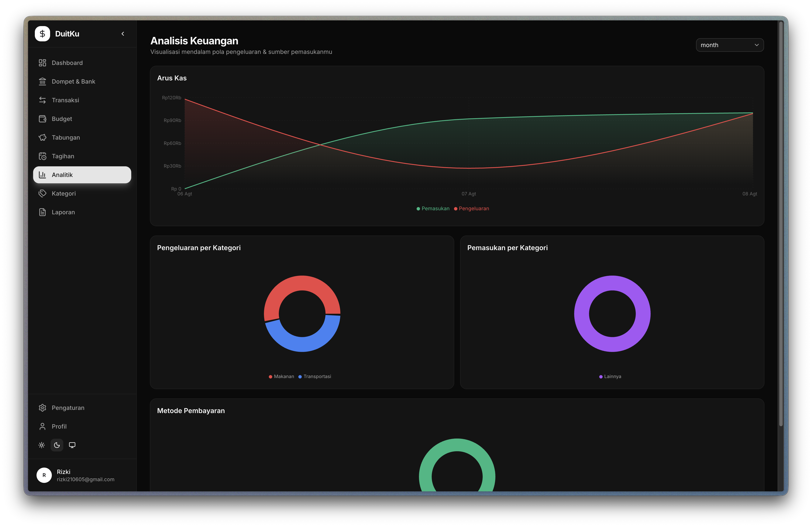
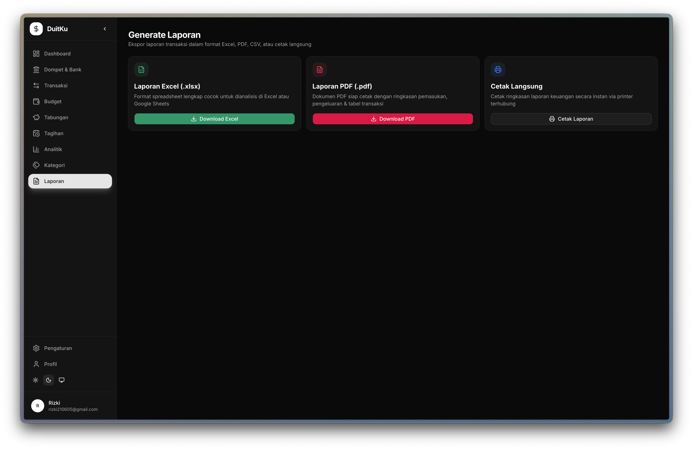

### Kategori & Pengaturan Sistem
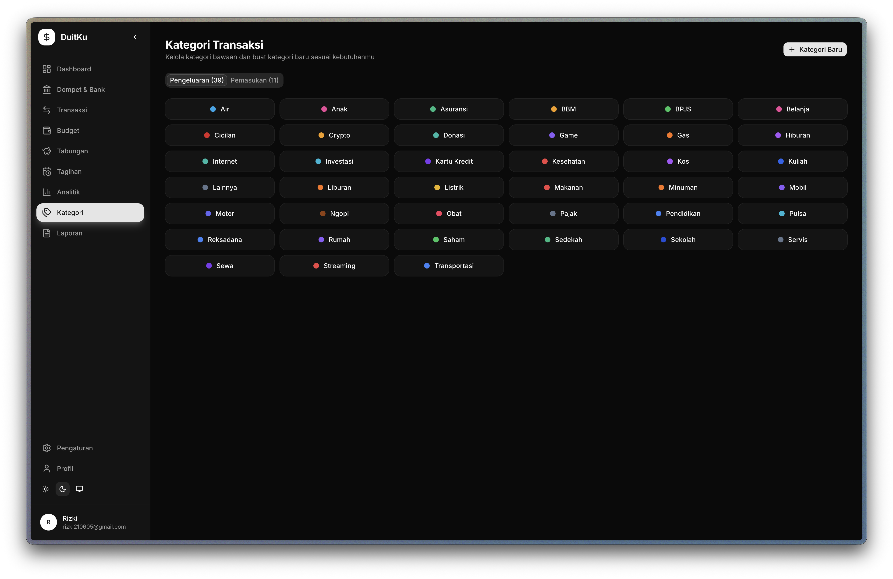
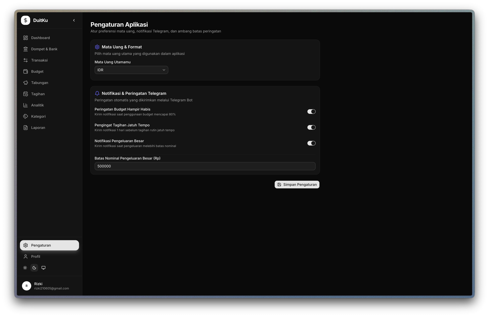
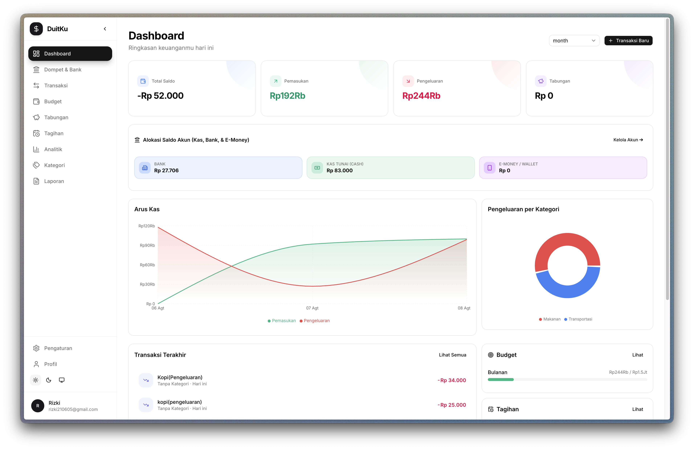

---

## Fitur Utama

- **Pencatatan Keuangan Lengkap**: Mendukung transaksi Pemasukan, Pengeluaran, dan Transfer antar rekening/dompet.
- **Manajemen Dompet & Rekening**: Kelola alokasi saldo real-time di Rekening Bank, Kas Tunai (Physical Cash), dan E-Money (GoPay, DANA, OVO, ShopeePay, QRIS).
- **Kalkulator Dana Darurat**: Menghitung target dana darurat ideal (3, 6, 9, hingga 12 bulan) berdasarkan status tanggungan dan pengeluaran bulanan.
- **Target Tabungan (Saving Goals)**: Pemantauan alokasi dana dan persentase progres tabungan impian.
- **Budgeting Berdasarkan Kategori**: Batas pengeluaran bulanan per kategori atau keseluruhan transaksi dengan indikator persentase.
- **Dashboard & Analitik Visual**: Visualisasi arus kas (Cashflow), diagram lingkaran kategori, dan metode pembayaran menggunakan Recharts.
- **Tagihan Rutin & Pengingat**: Pengingat tanggal jatuh tempo pembayaran listrik, internet, langganan, dan fasilitas lainnya.
- **Integrasi Telegram Bot**:
  - Perintah bot: /start, /help, /saldo, /dompet, /budget, /statistik, /danadarurat
  - Pencatatan cepat berbasis bahasa alami: +500000 Gaji bank, -25000 Makan cash, -15000 Kopi gopay
- **Laporan Otomatis (Cron Job)**:
  - Laporan ringkasan mingguan setiap hari Minggu.
  - Laporan bulanan dan otomatisasi lampiran dokumen CSV yang dikirim langsung ke Telegram.
- **Ekspor Data & Cetak**: Ekspor data ke format Excel (.xlsx), PDF (.pdf), CSV, serta fitur cetak langsung.
- **Desain Modern**: Antarmuka berbasis Dark Mode & Glassmorphic UI yang responsif menggunakan shadcn/ui dan Framer Motion.

---

## Tech Stack

- **Framework**: Next.js 15 (App Router) + React 19 + TypeScript
- **Styling**: TailwindCSS + shadcn/ui + Framer Motion
- **Database**: Cloudflare D1 (SQLite) via Drizzle ORM
- **Database Proxy**: Cloudflare Worker (Hono Framework)
- **Autentikasi**: Auth.js (NextAuth v5)
- **State & Validasi Form**: React Hook Form + Zod Schema
- **Grafik & Data Visual**: Recharts
- **Ekspor File**: XLSX + jsPDF + autoTable
- **Telegram Bot**: grammY Telegram SDK

---

## Panduan Instalasi & Deployment

### 1. Clone Repository & Install Dependencies
```bash
git clone https://github.com/ryuarnovi/Your-Money.git
cd Your-Money
npm install
```

### 2. Konfigurasi Environment Variables
Salin file `.env.example` menjadi `.env.local`:
```bash
cp .env.example .env.local
```

Sesuaikan nilai variabel environment pada `.env.local`:
```env
AUTH_SECRET="secret-32-karakter-bebas"
NEXTAUTH_URL="http://localhost:3000"

WORKER_API_URL="http://localhost:8787"
WORKER_API_KEY="dev-api-key"

CLOUDFLARE_ACCOUNT_ID="your-cloudflare-account-id"
CLOUDFLARE_DATABASE_ID="your-cloudflare-d1-database-id"
CLOUDFLARE_D1_TOKEN="your-cloudflare-d1-api-token"

TELEGRAM_BOT_TOKEN="your-telegram-bot-token"
TELEGRAM_WEBHOOK_SECRET="your-webhook-secret"
```

### 3. Deploy Cloudflare Worker D1 Proxy
Masuk ke folder `worker/`:
```bash
cd worker
npm install
npx wrangler d1 create your-money-db
```
Perbarui `database_id` di file `wrangler.jsonc`, lalu jalankan deployment:
```bash
npx wrangler deploy
```

### 4. Migrasi Database
Jalankan migrasi tabel ke Cloudflare D1:
```bash
npm run db:push
```

### 5. Jalankan Aplikasi Lokal
```bash
npm run dev
```
Buka `http://localhost:3000` di browser.

---

## Menghubungkan Telegram Bot Webhook

Pengaturan webhook Telegram ke server pengujian atau server produksi:
```bash
curl -X POST "https://api.telegram.org/bot<TELEGRAM_BOT_TOKEN>/setWebhook" \
     -H "Content-Type: application/json" \
     -d '{ "url": "https://domain-anda.com/api/telegram", "secret_token": "<TELEGRAM_WEBHOOK_SECRET>" }'
```

---

## Lisensi

Proyek ini dilindungi di bawah lisensi MIT License. Lihat file [LICENSE](LICENSE) untuk informasi lebih lanjut.
